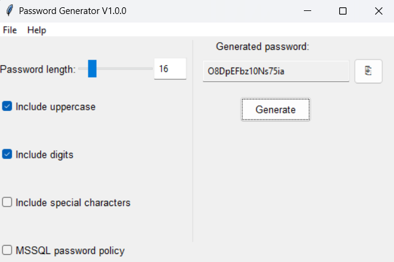

# Random Password Generator
## Overview
The Random Password Generator is a Python script designed to generate secure and random passwords based on user-specified criteria. It provides a simple yet robust solution for creating strong and customizable passwords for various purposes. The generator comes with a graphical user interface (GUI) implemented using the Tkinter library, making it user-friendly and accessible. The GUI allows users to easily customize password parameters such as length, character sets, and MSSQL policy. With features like password length slider, direct entry, and convenient copy-to-clipboard functionality, the GUI enhances the overall user experience, providing a seamless way to generate and use strong passwords.

## Features

- **Password Customization:** Specify password length and choose whether to include uppercase letters, lowercase letters, numbers, and special characters.
- **Randomization:** Utilizes a strong randomization algorithm to ensure password security.
- **User-Friendly Interface:** The tool offers a simple command-line interface (CLI) for ease of use.

## Getting Started

### Installation
- Clone the repository to your local machine.
  ```bash
  git clone https://github.com/Matthias-Johannes-Mack/randomPasswordGenerator.git
  
### Usage:
- Navigate to the project directory.
- Run the script by executing the following command:
 ```bash
  python password_generator.py
 ```
- Follow the on-screen prompts to customize and generate your random password

### Usage Examples:
  ```bash
    # Generate a random password of length 12 with uppercase letters, lowercase letters, and numbers.
    python password_generator.py -l 12 -u -d

    # Generate a random password of length 16 with all character types (uppercase, lowercase, numbers, and special characters).
    python password_generator.py -l 16 -u -d -s
  ```
### Command-Line Arguments for Password Generator

The following command-line arguments are designed for a password generator script, allowing users to customize the characteristics of the generated passwords:

1. **-l, --length**
   - **Type:** Integer
   - **Default:** 12
   - **Description:** Specifies the length of the generated password. Users can provide an integer value to determine the desired length. If not specified, the default length is set to 12 characters.

2. **-u, --include-uppercase**
   - **Action:** boolean set to true
   - **Description:** Indicates whether the generated password should include uppercase letters. If this flag is present, uppercase letters will be included; otherwise, they will be excluded.

3. **-d, --include-digits**
   - **Action:** boolean set to true
   - **Description:** Specifies whether the generated password should include digits (numbers). If this flag is present, digits will be included; otherwise, they will be excluded.

4. **-s, --include-special-chars**
   - **Action:** boolean set to true
   - **Description:** Determines whether the generated password should include special characters (e.g., symbols, punctuation). If this flag is present, special characters will be included; otherwise, they will be excluded.


5. **-m, --mssql-policy**
   - **Action:** boolean set to true
   - **Description:** When this flag is set, the application will generate a password that matches the current mssql password policy which includes:
      - At least 8 characters long.
      - Contains characters from at least three of the following four categories:
         - Latin uppercase letters (A through Z)
         - Latin lowercase letters (a through z)
         - Base 10 digits (0 through 9)
         - Non-alphanumeric characters such as: exclamation point (!), dollar sign ($), number sign (#), or percent (%)   

# GUI

This section provides an overview of the graphical user interface (GUI) for the Password Generator application. The GUI is implemented using the Tkinter library in Python.

## Table of Contents

- [Overview](#overview)
- [Structure](#structure)
- [User Interface Elements](#user-interface-elements)
  - [Password Length](#password-length)
  - [Password Length Slider](#password-length-slider)
  - [Password Length Entry](#password-length-entry)
  - [Options](#options)
  - [MSSQL Policy](#mssql-policy)
  - [Generated Password Display](#generated-password-display)
  - [Copy Button](#copy-button)
  - [Generate Password Button](#generate-password-button)
- [Styles](#styles)
- [Menu](#menu)
- [Functionality](#functionality)
  - [Password Generation](#password-generation)
  - [Animation](#animation)
  - [Clipboard Copy](#clipboard-copy)
  - [About Dialog](#about-dialog)
  - [Application Exit](#application-exit)
- [Internationalization (i18n)](#internationalization-i18n)
  - [Language Selection](#language-selection)
  - [Localization of Strings](#localization-of-strings)
  - [Updating Language](#updating-language)
  - [Language Configuration](#language-configuration)
  - [Language Settings](#language-settings)
  - [Available Languages](#available-languages)
  - [Default Language](#default-language)

## Overview

The Password Generator GUI is designed to provide a user-friendly interface for generating secure passwords. It allows users to customize various parameters such as password length and character set options. The generated password can be copied to the clipboard for easy use.

## Structure

The GUI is divided into two main panels using the `PanedWindow` widget, providing a clear separation between input options and the generated password display.

## User Interface Elements

### Password Length

Users can specify the desired length of the password. The length can be set using both a slider and a direct entry option. Remark that if the mssql policy is enforced, the password length will be at least 8 characters long.

### Password Length Slider

The slider allows users to visually select the password length within a predifined range.

### Password Length Entry

The entry widget enables users to input the desired password length directly. The input is validated to ensure it only contains integers.

### Options

Users can customize the character set of the password by selecting options such as including uppercase letters, digits, special characters, and an MSSQL policy.

### MSSQL Policy

A checkbox to enable or disable the MSSQL password policy. When enabled, it ensures that the generated password complies with the MSSQL password policy.

### Generated Password Display

The generated password is displayed in a readonly entry widget, making it easy for users to view and copy.

### Copy Button

A button with a clipboard symbol allows users to copy the generated password to the clipboard for quick use.

### Generate Password Button

This button triggers the password generation process, taking into account the selected options.

## Styles

The GUI elements are styled using the `ttk.Style` class, providing a modern appearance. Styles include button padding, relief, foreground color, font, and more.

## Menu

The menu bar includes options for file operations (exit) and help (about).

## Functionality

### Password Generation

The password is generated based on user-defined parameters, including length and character set options.

### Animation

A simple animation pattern is displayed during password generation, providing visual feedback to the user.

### Clipboard Copy

The generated password can be copied to the clipboard with a single click, enhancing user convenience.

### About Dialog

An "About" dialog provides information about the application.

### Application Exit

The application can be exited gracefully using the exit option in the menu.

## Internationalization (i18n)

The Password Generator GUI supports internationalization to provide a localized user experience.

### Language Selection

Users can select their preferred language from a list of available options.

### Localization of Strings

All user-facing strings in the GUI are internationalized using the `gettext` module. This allows for easy translation into different languages.

### Updating Language

The selected language is updated dynamically, reflecting changes across the entire GUI.

### Language Configuration

The language configuration is handled through a settings file, allowing users to persist their language preference between sessions.

### Language Settings

#### Available Languages

The following languages are available for selection:

- English
- German
- Spanish
- French
- Italian
- Chinese

#### Default Language

The default language is set to English. Users can change the language in the settings to suit their preferences.


# Testing

The Random Password Generator includes a comprehensive test suite to ensure the correctness of its functionality. To run the tests, follow these steps:

1. Open a terminal or command prompt.

2. Navigate to the project's root directory.

3. Run the following command to discover and execute all unit tests:

    ```bash
    python -m unittest discover ./tests/
    ```

    This command will automatically discover and execute all the unit tests in the `tests` directory.

4. Review the test results to ensure that all tests pass successfully.


# Contributing
If you'd like to contribute to this project, please follow these steps:

- Fork the repository
- Create a new branch for your feature or bug fix
- Implement your changes and test thoroughly
- Submit a pull request, explaining the changes and providing necessary documentation

# License
This project is licensed under the MIT License